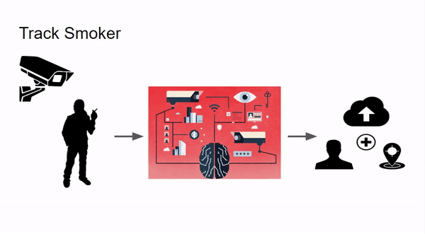

# Hi, Welcome to Track Smoker Project:

## Problem Statement:
Develop a system that can detect whether a person is smoking or not in public place and automatically report it to Law and Enforcement authorities with the location. 

## Project in a nutshell
<ul>
<li>
Uses Machine Learning to Identify a person is smoking or not, if found smoking then report to law enforcement authority with smoker’s  picture and location
</li>
<li>
  Using Convolutional Neural Network(CNN) Architecture, Integrated with a web application for user friendliness
</li>
<li>
Main Tools Used : TensorFlow, Keras, Scikit learn, NumPy, MySQL
</li>
<ul/>

## Model Architecture 

