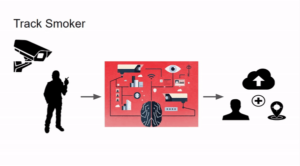

# Track Smoker

**Detecting smoking in images using transfer learning, as a step toward automated public-smoking detection.**

## Problem Statement

Develop a system that can detect whether a person is smoking in a public place, with the eventual goal of automatically reporting it — along with the smoker's picture and location — to law enforcement authorities.

## Project in a Nutshell

- Uses a Convolutional Neural Network (CNN), built via **transfer learning on InceptionV3**, to classify an image as "Smoking" or "Not Smoking."
- Trained on a labeled image dataset (CCTV-style and general photos) pulled from a companion dataset repository.
- Intended to be integrated with a web application for user-friendliness, with some early groundwork in the notebook for exporting the trained model to TensorFlow.js for web/browser use.
- Main tools used: **TensorFlow, Keras, scikit-learn, NumPy, scikit-image**.

## How It Works

The pipeline lives in [`Track_Smoking.ipynb`](Track_Smoking.ipynb):

1. **Base model – transfer learning with InceptionV3** — `InceptionV3` (pretrained on ImageNet, `include_top=False`) is loaded as a frozen feature extractor (`base_model.trainable = False`) with an input shape of `299 x 299 x 3`.
2. **Classifier head** — A `GlobalAveragePooling2D` layer followed by a `Dense(2)` layer is stacked on top of the base model in a `Sequential` model (`model2`), producing a 2-class output (smoking / not smoking).
3. **Compilation** — The model is compiled with the `RMSprop` optimizer (learning rate `0.0001`), `BinaryCrossentropy` loss, and `accuracy` as the tracked metric.
4. **Dataset** — Training/validation images are pulled by cloning a separate repository, [`Data_Track_illegal_activities`](https://github.com/sreeragrnandan/Data_Track_illegal_activities), which contains `Smoking/train/{smoking,not_smoking}` and `Smoking/validation/{smoking,not_smoking}` image folders.
5. **Data augmentation** — Keras' `ImageDataGenerator` is used as a regularizer, applying random rotation, zoom, width/height shifts, shear, and horizontal flips to the training images for better generalization.
6. **Data loading for training** — `flow_from_directory` builds train and validation generators with InceptionV3's `preprocess_input`, resizing all images to `299 x 299`.
7. **Training** — The model is trained with `fit_generator` for 15 epochs (`steps_per_epoch=89`, `validation_steps=80`), and the trained model is saved to `model.h5`.
8. **Inference** — A `load_image` helper reads a JPEG, resizes it to `299 x 299`, and applies InceptionV3 preprocessing. The model then predicts a class, mapped to `CLASS = ["Smoking", "Not Smoking"]` via `argmax`. The notebook downloads a handful of individual sample images (both smoking and not-smoking, from train and validation splits) with `wget` to manually spot-check predictions.
9. **(Exploratory) Web export** — There's commented-out code using `tensorflowjs` to convert the trained Keras model into a TensorFlow.js model, which points at the intended path of embedding this model directly into a web application front end.

### Model Structure

✌ Performed transfer learning with InceptionV3 to make a base model:
```python
IMG_SHAPE = (IMG_SIZE, IMG_SIZE, 3)

# Create the base model from the pre-trained model InceptionV3
base_model = tf.keras.applications.InceptionV3(input_shape=IMG_SHAPE,
                                               include_top=False,
                                               weights='imagenet')
```

🤯 Constructed the classifier head, and chose the optimizer and loss function:
```python
global_average_layer = tf.keras.layers.GlobalAveragePooling2D()
prediction_layer = tf.keras.layers.Dense(2)

model2 = tf.keras.Sequential([
  base_model,
  global_average_layer,
  prediction_layer
])

base_learning_rate = 0.0001
model2.compile(optimizer=tf.keras.optimizers.RMSprop(lr=base_learning_rate),
              loss=tf.keras.losses.BinaryCrossentropy(from_logits=False),
              metrics=['accuracy'])
```

#### 😵 Model Summary
```
Model: "sequential"
_________________________________________________________________
Layer (type)                 Output Shape              Param #   
=================================================================
inception_v3 (Model)         (None, 8, 8, 2048)        21802784  
_________________________________________________________________
global_average_pooling2d (Gl (None, 2048)              0         
_________________________________________________________________
dense (Dense)                (None, 2)                 4098      
=================================================================
Total params: 21,806,882
Trainable params: 4,098
Non-trainable params: 21,802,784
_________________________________________________________________
```

Since the InceptionV3 base is frozen, only the final `Dense` layer (4,098 params) is actually trained — this is a feature-extraction style transfer-learning setup rather than full fine-tuning.

### Data Processing

😎 Used image augmentation as a regularizer to get better generalization performance:
```python
aug = ImageDataGenerator(
		rotation_range=30,
		zoom_range=0.15,
		width_shift_range=0.2,
		height_shift_range=0.2,
		shear_range=0.15,
		horizontal_flip=True,
		fill_mode="nearest")
```

🤓 Performed data pre-processing to match InceptionV3's expected input:
```python
def load_image(image_path):
    img = tf.io.read_file(image_path)
    img = tf.image.decode_jpeg(img, channels=3)
    img = tf.image.resize(img, (299, 299))
    img = tf.keras.applications.inception_v3.preprocess_input(img)
    return img
```

➗ Divided training and validation data into batches for faster training and better generalization, using Keras generators; 🤩 at the same time the images are resized and labeled automatically from their folder structure:
```python
# Flow training images in batches using train_datagen generator
train_generator = train_datagen.flow_from_directory(
        train_dir,  # This is the source directory for training images
        target_size=(299, 299),  # All images will be resized to 299x299
        batch_size=100,
        # Since we use binary_crossentropy loss, we need binary labels
        class_mode='binary')

# Flow validation images in batches using val_datagen generator
validation_generator = val_datagen.flow_from_directory(
        validation_dir,
        target_size=(299, 299),
        batch_size=40,
        class_mode='binary')
```

### 😍 Prediction Step
```python
# Smoking on validation
img=load_image("./image_name.jpg")
predict = model2.predict(np.expand_dims(img,0))
print(CLASS[np.argmax(predict)])
```

## Project Snapshot



## Repository Structure

| File | Description |
|---|---|
| [`Track_Smoking.ipynb`](Track_Smoking.ipynb) | Main notebook: dataset setup, transfer-learning model, augmentation, training, and inference on sample images. |
| `Architecture.gif` | Architecture / workflow diagram shown above. |
| `LICENSE` | MIT License. |
| `readme.md` | This file. |

## Getting Started

The notebook is written for **Google Colab**.

1. Open `Track_Smoking.ipynb` in Google Colab.
2. Run the setup cells — the notebook clones the companion dataset repo [`Data_Track_illegal_activities`](https://github.com/sreeragrnandan/Data_Track_illegal_activities) directly via `git clone`, so no manual dataset upload is required.
3. Run the remaining cells in order to build the InceptionV3-based model, train it on the smoking/not-smoking image folders, and run predictions on sample images.

### Dependencies

- TensorFlow / Keras
- NumPy
- scikit-learn
- scikit-image

## License

This project is licensed under the MIT License — see [`LICENSE`](LICENSE) for details.
